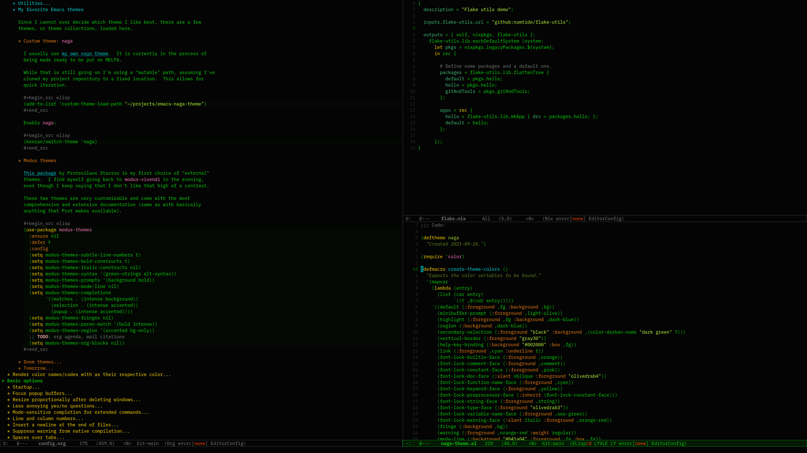

# Naga: an Emacs theme (WIP)

The main feature of this dark color theme is its usage of a green
foreground color, achieving a retro look while still being easy on the
eyes.

Note that while I've been using this as my main theme for nearly a
year now, it still is very much a work in progress, as I've only
styled and checked the packages I actually use so far.  Some main
colors might still be subject to change, I'm mainly unhappy with pink
(maybe try out a more purple-ish tone instead) and the coloring of
strings.

## Installation

I'm planning to put this on MELPA at some point.  For now, clone this
repository and add make the location known to Emacs as follows:

```elisp
(add-to-list 'custom-theme-load-path
             "~/path/to/emacs-naga-theme")
```

Then `naga` should appear as an option when doing `M-x load-theme`.

## Screenshot(s)


